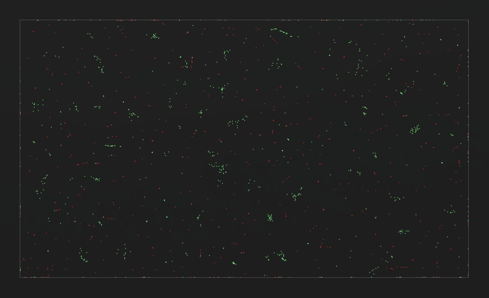

# Cellula

A lightweight engine for simulating and exploring **Life Particle**, **Prey vs Predators** and **Cellular Automata (CA)** simulations. This project provides a modular framework to build, visualize, and analyze grid-based discrete dynamical systems with custom rulesets.

---

## ⚠️ Work In Progress

**Note:** This project is currently in the early. The core engine is functional, but the features are subject to frequent changes.

### Current Progress

Below is a glimpse of the current state of the simulation engine:

---

## Features (Planned & Current)

- **Customizable Rules**: Define your own birth/survival rules or complex state transitions.
- **Visualization**: Tools for rendering simulation steps.
- **Optimized Engine**: Fast grid updates for smooth simulation flow.

## Project Structure

- `/src`: Core logic for the ngine.
- `/config`: App and simulations configurations.

